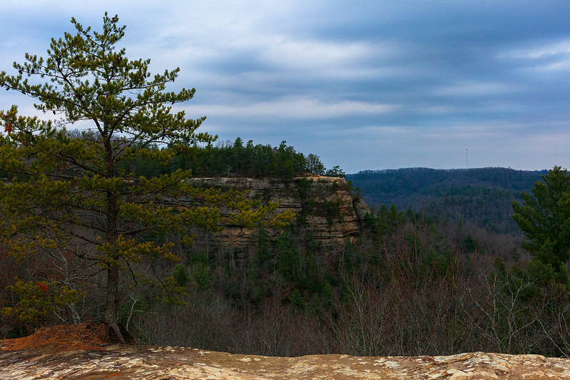

# block_distortion

A command line tool and Python 3.6 library for "block distortion" effects on images.

For example:


The original:



_Image credit: Braden Tholkes ([Flickr](https://www.flickr.com/photos/tholkesbraden/))._

## Installation
`pip install block_distortion` (requires Python >= 3.6)

## Command Line Usage
At the moment, there are two commands: `animate` and `single`.

### `animate`:

**TLDR**: `block_dist animate <image path>`

```
Usage: block_dist animate [OPTIONS] IMAGE_PATH

  Produce a gif with distortion effects from an image.

Arguments:
  IMAGE_PATH  Input file (png, jpg, etc)  [required]

Options:
  -f, --frames INTEGER    Number of frames in output gif  [default: 30]
  -d, --duration INTEGER  Duration of each frame in output gif (ms)  [default:
                          100]

  -s, --splits INTEGER    Number of times to split the image (higher makes a
                          'smoother' looking image)  [default: 2000]

  -o, --out TEXT          Name of output file (gif)  [default: ./output.gif]
  --help                  Show this message and exit.
```


### `single`:

**TLDR**: `block_dist single <image path>`

```
Usage: block_dist single [OPTIONS] IMAGE_PATH

  Produce a single image with distortion effects.

Arguments:
  IMAGE_PATH  Input file (png, jpg, etc)  [required]

Options:
  -s, --splits INTEGER  Number of times to split the image  [default: 2000]
  -o, --out TEXT        Name of output file (gif)  [default: ./output.png]
  --help                Show this message and exit.

```

## Library Usage Examples

### Animation:

```python
from skimage.io import imread
from block_distortion import animate_image, write_frames_to_gif

input_image = imread("./example.png") # Read image
frames = animate_image(input_image) # Create frames (same options available as on cmd line)
write_frames_to_gif("./output.gif", frames, duration=100) # Write to output file
```

### Single:
```python
from skimage import img_as_ubyte
from skimage.io import imread, imsave
from block_distortion import distort_image

# Read Image
input_image = imread("~/Desktop/Face.jpeg") # Read image
distorted = distort_image(input_image) # Create distorted image
imsave("./output.png", img_as_ubyte(distorted)) # Save image
```

## How does it work?
For the curious, the algorithm goes like this:

1. Split the image into two parts, unformly choosing where to split and whether to split vertically or horizontally.
2. Split the largest part of the image (repeat times the number of splits the user specified).
3. Color the parts with the average color of that area in the original image.
4. To create GIFs, repeat 1-3 for each frame (you get a different split each time).
